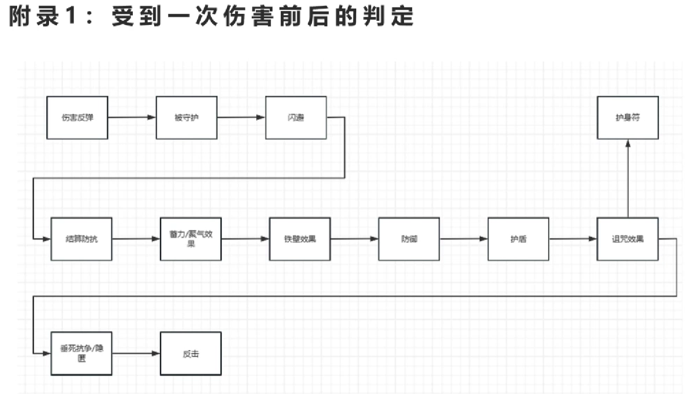

# Chapter: 技能详解

说明：本章基于图片转文字（OCR）稿整理，严格保留原作者在图片中的主动/被动技能顺序与结构，仅做格式化与少量排版调整以便于阅读与站点发布。数值、判定与公式均直接采用 OCR 原文，若需最终校验请对照原始图片。

> **待校验项（需对照原图确认）**：
> 
> 1. **瘟疫命中算法**：`（400 - 目标当前生命）/ 3 *（目标法抗+目标敏捷）` 的运算顺序暂不明确，保留原文表述
> 2. **七围 -36 适用范围**：OCR 原文表述为"召唤物属性以外的七围均为实际值"，需确认召唤物是否也适用 -36 规则

## 说明（总则）

1. 七围在战斗中的实际值与面板值不同：攻击、防御、敏捷、法力、法抗、智力 全部减 36，速度加 124。本章涉及的召唤物属性以外的七围均为实际值。
2. 判定（智）：号的智力越高，越可能依照此规则来决定技能的使用。
3. 判定（固定）：号必须根据此规则来决定技能的使用。
4. 命中算法：对技能命中概率的一般拟合，普通攻击为（自身法力或攻击 + 自身敏捷）/（目标法抗或防御 + 目标敏捷）。
5. 蓄力效果：在使用此技能前使用蓄力且未被打消，则触发该技能的蓄力增强效果。
6. 行动后解除：指状态持续时间为 0 时的回合的行动后解除。
7. 技能等级：即技能熟练度。每个名字有其对应的技能和技能熟练度；熟练度的高低影响技能的发动概率（该描述来自官网）。

---

# 主动技能

定义：在自身的行动阶段发动的技能。（自身在 SP ≥ 2048 时消耗 2048 的 SP 进入行动准备阶段，在 MP > 0 时可以消耗 MP 以发动主动技能，SP、MP 的算法较为复杂，在讨论时只需知道速度与 SP、智力与 MP 各自成正相关关系）。

分类：
* 伤害类（造成伤害的技能，有的技能能在造成伤害后触发额外的效果）
* 控制类（为技能目标施加负面效果的技能）
* 强化类（为自身施加增益效果的技能）
* 辅助类（为技能目标施加增益效果或回复生命的技能）
* 召唤类（召唤召唤物的技能）
* 效果类（对技能目标释放时无视闪避以外的大部分判定的技能）

---

## 吸血攻击

类型：**伤害类** / 生命回复 / 法伤

效果：造成 130% 的伤害，命中后恢复伤害量 50%（向上取整）的生命（不会超过自身生命上限，可以为 0）。

判定（智）：当前生命 ≥ 最大生命 - 32 时不发动。

---

## 聚气

类型：**强化类** / 增益状态

效果：自身永久获得 **聚气状态**，自身的伤害系数（在结算防抗后与伤害乘算，初始为 1）变为现在的 170%，若自身**聚气状态**在此次战斗中被打消过，则变为现在的 160%。

（**聚气状态**：增益状态，不解除，可被打消，**聚气效果**与**蓄力效果**乘算），自身 SP 增加 400。

判定（智）：当前生命 ≤ 120 时不发动。判定（固定）：处于**聚气状态**时不发动，被打消后可再次发动。

蓄力效果：自身获得**聚气状态**：自身伤害系数变为原本的 270%，若**聚气状态**在此次战斗中被打消过，则变为现在的 260%；自身 SP 增加 900，其它不变。

---

## 潜行 / 背刺

类型：**伤害类** / 分阶段 / 真实伤害（伤害与法力相关）

效果：分 2 个阶段，每阶段消耗一回合。**潜行阶段**选定目标并准备，自身 SP 增加（自身法力 * 3），**背刺阶段**对选定的目标造成期望为 n% 的伤害。（真实伤害，伤害较为稳定，无视**伤害反弹**与**守护**，无法闪避，n 的算法见右下图）。执行**背刺阶段**前，若自身中途受到大于 0 的伤害（包括**生命之轮**与**瘟疫**）或选定的目标死亡，则中断技能，不会因控制技能的效果而中断。

判定（智）：当前生命 ≤ 160 时不发动，自身处于**中毒状态**时不发动，优先选择当前生命比例最高的目标。

蓄力效果：**潜行阶段**选定目标并准备，自身 SP 增加（1600 + 自身法力 * 3），**背刺阶段**前，不会因自身受到伤害而中断技能。

右侧公式算法：

```
0 < a,b,c < 1
n = max(a,b,c)*400
```

---

## 狂暴术

类型：**伤害类** / **控制类** / 法伤

效果：造成 100% 的伤害，命中并造成伤害后为目标施加 1 回合的 **狂暴状态**（**狂暴状态**：负面状态，行动后解除，可被驱散；**狂暴状态**下只能进行敌我不分的**狂暴攻击**，不会影响**背刺**的发动）。**狂暴效果**可叠加，叠加后此状态持续时间增加 1 回合。

判定（智）：优先选取未处于**狂暴状态**的目标，优先选取非召唤物。

蓄力效果：造成 200% 的伤害，命中并造成伤害后为目标施加 2 回合的 **狂暴状态**，若目标已处于**狂暴效果**，则使此状态持续时间增加 2 回合。

---

## 狂暴攻击

类型：**伤害类** / 技能附加 / 物伤

效果：造成 120% 的伤害。

判定（固定）：选取任何单位（包括自身）作为目标。

---

## 蓄力

类型：**强化类** / 增益状态

效果：自身获得 **蓄力状态**：下回合结束前，自身伤害系数（在结算防抗后与伤害乘算，初始为 1）变为现在的 300%（**蓄力状态**：增益状态，行动后解除，可被打消，**蓄力效果**与**聚气效果**乘算），自身 SP 增加 32，对部分技能的特殊加成会在这些技能的描述中单独说明。

判定（智）：当前生命 ≤ 100 时不发动。
判定（固定）：处于**蓄力状态**时不发动。

---

## 魅惑

类型：**效果类** / **控制类**

效果：命中后为目标施加 1 回合的 **魅惑状态**（**魅惑状态**：负面状态，行动后解除，可被驱散；**魅惑状态**下会将此状态的施加者视为队友使用主动技能及进行**守护**，不会影响**背刺**的发动），若目标已处于**魅惑状态**，改为命中后使此状态持续时间增加 1 回合。

命中算法：自身法力 /（目标法抗 + 目标敏捷）

判定（智）：优先选取未处于**魅惑状态**或处于**魅惑状态**但持续时间小于 2 回合的目标。

蓄力效果：命中后为目标施加 4 回合的 **魅惑状态**，若目标已处于**魅惑状态**，改为命中后使此状态持续时间增加 4 回合。

---

## 分身

类型：**召唤类**

效果：召唤一个生命、生命上限为自身当前的 **50%**，七围为自身当前的 **60%** 的 **分身**。

（**分身**：非召唤物，不因召唤者死亡而消失，记分时不视为本体，继承召唤者此技能使用后的的技能及技能等级，不继承状态）。技能使用后，自身生命、最大生命变为自身当前的 50%。

使用后自身**分身**的技能等级变为 `0.75 * n`（n 为使用前此技能的技能等级），若 自身生命 + 自身法力 ≥ r(255)（`r(n)` 表示在 [0, n] 区间随机取一个整数，每次取 r(n) 都是互不影响的随机取值），自身**分身**的技能等级改为 `0.75 * (0.5 * n + 1)`。使用后自身 SP 增加 `1024~1536`，**分身** SP 增加 `600~1112`。

蓄力效果：**分身**的八围为自身当前的 100%，技能使用后自身生命、生命上限不变，其它不变。

---

## 会心一击

类型：**伤害类** / 物伤

效果：造成期望为 n% 的伤害，伤害较为稳定。（正常情况下造成 x% 的伤害意为期望为 x% * a (0 < a < 1) 的伤害，n 的算法见右图）

右侧公式算法：

```
0 < a,b,c < 1
x = 1.15*a
y = 1.2*b
z = 1.25*c
n = max(x,y,z)*100
```

---

## 诅咒

类型：**伤害类** / **控制类** / 法伤

效果：造成 100% 的伤害，命中后为目标施加 **诅咒状态**。（**诅咒状态**：负面状态，不解除，可被驱散；**诅咒状态**下受到的伤害有 66.7% 的概率增加 100%（在结算防抗后与伤害乘算），**诅咒效果**可叠加，叠加效果改为伤害初始有 (66.7 + n*15.87) % 的概率增加 (100 + (n-1) * 100) %，其中 n 为**诅咒效果**叠加的层数）

判定（智）：优先选取生命 ≥ 80 目标，优先选取未处于**诅咒状态**的目标。

蓄力效果：造成 300% 的伤害，若命中，则立刻叠加二层**诅咒效果**。

---

## 净化

类型：**伤害类** / **控制类** / 驱散 / 真实伤害（伤害与法力相关）

效果：造成 100% 的伤害（真实伤害，无视**伤害反弹**与**守护**，无法闪避），命中并造成大于 0 的伤害后驱散目标所有的增益状态。若目标的当前 MP > 64，使目标的 MP 减少 64，反之，使目标的 MP 减少 32（目标的 MP 始终 ≥ 0）。若目标为召唤物，基础伤害变为 200%。

判定（智）：优先选取生命 ≥ 100 目标，更优先选取召唤物。

---

## 生命之轮

类型：**效果类**

效果：命中后和目标体力值互换（自身的生命始终不会高于自身生命上限），命中后会触发伤害判定。使用后自身**生命之轮**的技能等级变为 `(0.5 * n + 1)`（n 为使用前此技能的技能等级）。

命中算法：自身法力 /（目标防御 + 目标法抗 + 目标敏捷）

判定（智）：优先对当前生命至少比自身多 32 的目标释放。

判定（固定）：只对当前生命比自身多的目标释放。

蓄力效果：效果改为必中，命中后将目标的 SP 减少至 0，自身 SP 增加目标 SP 的减少值。

---

## 火球术

类型：**伤害类** / 火焰伤害 / 法伤

效果：造成 `(150 + n * 50)%` 的伤害（n 为目标已经受到的大于 0 的火焰伤害的次数，目标死亡后 n 变为 0）。

---

## 瘟疫

类型：**效果类**

效果：命中后使目标按比例损失 `(47 + 0.5 *（自身法力 -（0.5 * 目标法抗））)%` 的当前生命，最多损失 99%。命中后会触发伤害判定。

命中算法（简化后）：（400 - 目标当前生命）/ 3 *（目标法抗 + 目标敏捷）

判定（智）：优先对当前生命 ≥ 100 的目标释放。

蓄力效果：命中后使目标按比例损失（自身法力 + 50）% 的当前生命，最多损失 99%。

---

## 加速术

类型：**辅助类** / 增益状态

效果：使自身或一个队友获得 **加速状态**：速度增加 100%，持续 3 回合（**加速状态**：增益状态，行动后解除，可被打消，**加速效果**可叠加，叠加后此状态持续时间增加 4 回合，与**垂死抗争效果**的结算方式为 目标速度 * **加速效果** + **垂死抗争效果**；与**减速效果**乘算）。

判定（智）：优先选择 当前生命 ≥ 60 及 当前生命 ≤ 60 *（**加速状态**剩余持续回合数 + 1） 的目标，优先选择非召唤物。

蓄力效果：使自身或一个队友获得 **加速状态**：速度增加 300%，持续 5 回合，若目标已处于 **加速状态**，则使此状态持续时间增加 6 回合，速度增加 300%，其它不变。

---

## 治愈魔法

类型：**辅助类** / 生命回复

效果：为自身或一个队友回复等同于 100% 法术伤害的生命（与伤害类技能的初始结算方式相似，目标的生命始终不会高于最大生命），并驱散其所有的异常状态。（使用前，若自身此技能的技能等级大于 8，则此技能的技能等级减少 1）

判定（智）：优先选择 当前生命 < 最大生命 - 80 的目标。

判定（固定）：只选择 当前生命 < 最大生命 的目标。

蓄力效果：为自身或一个队友回复等同于 300% 法术伤害的生命，其它不变。

---

## 冰冻术

类型：**伤害类** / **控制类** / 法伤

效果：造成 70% 的伤害，命中后为目标施加 1024 点 **冰冻标记**。并使目标进入 **冰冻状态**（**冰冻状态**：负面状态，行动前解除，可被驱散；**冰冻状态**下，行动准备阶段，**护盾** 与 **隐匿** 的效果发动后，若 **冰冻标记** > 0，令 **冰冻标记** 减少当前 SP 的数值并取消此次行动；反之，解除 **冰冻状态**）。**冰冻标记**可叠加，叠加效果为 **冰冻标记** 增加 1024 点。

蓄力效果：造成 210% 的伤害，命中后为目标施加 3096 点 **冰冻标记**。

---

## 铁壁

类型：**强化类** / 增益状态

效果：自身获得 **铁壁状态**：具有（110 + 自身法力）的**屏障**（受到 ≤ **屏障** 的伤害时，自身只受到 1 点伤害，反之则打破铁壁，受到原有伤害值 - **屏障** 的伤害），自身嘲讽值变为现在的 112%（与**隐匿效果**乘算，嘲讽值越高越容易被敌人选中），持续 2 回合。（**铁壁状态**：增益状态，行动后解除，可被打消）

判定（固定）：处于 **铁壁状态** 时不发动。

蓄力效果：自身获得 **铁壁状态**：具有（340 + 自身法力 * 5）的**屏障**，持续 6 回合。

---

## 投毒

类型：**伤害类** / 法伤

效果：造成 100% 的伤害，命中并造成伤害为目标施加 4 回合的 **中毒状态**（**中毒状态**：负面状态，行动后解除，可被驱散；**中毒状态**下行动后，受到无法闪避、无视**伤害反弹**的**中毒伤害**）。**中毒效果**可叠加，叠加效果改为命中并造成伤害后使**中毒伤害**增加，增加值与最开始中毒时的中毒效果相同，**中毒状态**的剩余持续时间变为 4 回合。

间接伤害算法（**中毒伤害**）：如右图。t 为**中毒状态**的剩余持续时间，s 为最开始中毒时**中毒效果**的数值（120% 的法术伤害），实际单次**中毒**第 (5-t) 次的**中毒伤害**可近似为（r /（中毒者的法力 + 64））。

右侧公式算法：

```python
for t in range(4, 1, -1):
    n = s
    r = s * (1 + (t - 1) * 0.1) / t
    s = n - r
```

---

## 地裂术

类型：**伤害类** / 群体伤害 / 法伤

效果：对至多 4~5 个目标造成 （244 / （n + 0.6））% 的伤害（n 为目标数量，此技能最大目标数随机）。

判定（固定）：尽可能多地选择目标。

---

## 连击

类型：**伤害类** / 多段伤害 / 物伤

效果：随机选择目标 2~3 次，共造成 2~3 次每次 75% 的伤害（最大伤害段数随机）；若连续 n 次击中同一目标，后续伤害变为（75 - 15 *（n - 1））%。若攻击杀死目标，则最大伤害段数 - 0.5（最终向上取整）；若触发闪避、**伤害反弹** 与 **守护**，以及自身死亡，则结束技能。

---

## 苏生术

类型：**辅助类** / 复活 / 生命回复

效果：**复活**一个已死亡的队友，为其回复等同于 80% 法术伤害的生命，保留其所有状态（与伤害类技能的初始结算方式相似，目标的生命始终不会高于最大生命）。使用后自身**苏生术**的技能等级变为（1 + n）/2（n 为触发前此技能的技能等级）。

判定（固定）：不选择召唤物，无法选择受**吞噬**和**召唤亡灵**效果影响的角色，在此前提下，无已死亡的队友时不发动。

蓄力效果：**复活**一个已死亡的队友，为其回复等同于 240% 法术伤害的生命。

---

## 幻术

类型：**召唤类**

效果：召唤一个生命在 77~192 之间，其它七围在 36~99 之间的 **幻影**（**幻影**：召唤物，会因召唤者死亡而消失，八围随机，技能：**附体**，**幻影**的八围与技能等级只与其召唤者的名字构成相关，同一个号及其**分身**召唤的**幻影**完全相同），**幻影**的召唤时的 SP 为 -2048。技能使用后，使自身**幻术**的技能等级变为 0.75 * n（n 为使用前此技能的技能等级）。

蓄力效果：**幻影**在召唤时的 SP 为 2048，其它不变。

---

## 附体

类型：**效果类** / 召唤物技能 / **控制类**

效果：命中后为目标施加 4 回合的 **狂暴状态**（**狂暴状态**：负面状态，行动后解除，可被驱散；**狂暴状态**下只能进行敌我不分的**狂暴攻击**，不会影响**背刺**的发动），若目标已处于**狂暴状态**，改为命中后使此状态持续时间增加 4 回合，使用后自身消失。

命中算法：自身法力 / 目标法抗

技能等级（固定）：在 60~92 之间随机。

---

## 减速术

类型：**效果类** / **控制类**

效果：命中后为目标施加 2 回合的 **减速状态**，速度减少为当前的 50%（**减速状态**：负面状态，行动后解除，可被驱散，**减速状态**可叠加，叠加后此状态持续时间增加 2 回合，与**垂死抗争效果**的结算方式为 目标速度 * **减速效果** + **垂死抗争效果**；与**加速效果**乘算）。

命中算法：自身法力 / 目标法抗。

判定（智）：优先选择 当前生命 ≥ 80 及 **减速状态**持续时间小于 1 回合的目标。

蓄力效果：命中后为目标施加 6 回合的 **减速状态**，若目标已处于 **减速状态**，则使此状态持续时间增加 6 回合，其它不变。

---

## 血祭

类型：**召唤类**

效果：召唤一个生命在 51~128 之间，攻击、法力为 36，防御、法抗与召唤者相同，其它三围在 36~99 之间的 **使魔**（**使魔**：召唤物，会因召唤者死亡而消失，**使魔**受到伤害时召唤者受到伤害量 50% 的间接伤害（向下取整），**使魔**八围随机，技能：**自爆**，**火球术**（**火球术**技能等级在为 1~32 之间随机），**使魔**的八围与技能等级只与其召唤者的名字构成相关，同一个号及其**分身**召唤的**使魔**完全相同），**使魔**在召唤时的 SP 为 0。

判定（智）：当前生命 < 80 时不发动。
判定（固定）：自身召唤的**使魔**消失前不发动。

蓄力效果：**使魔**的召唤时的 SP 为 2048，**使魔**受到伤害时召唤者不再受到间接伤害，其它不变。

---

## 自爆

类型：**伤害类** / 召唤物技能 / 火焰伤害 / 法伤

效果：造成 (400 + n * 50)% 的伤害（n 为目标已经受到的大于 0 的火焰伤害的次数，目标死亡后 n 变为 0），使用后自身消失。

技能等级（固定）：在 1~32 之间随机。

---

## 雷击术

类型：**伤害类** / 多段伤害 / 法伤

效果：造成 3~6 次每次 36% 的伤害（最大伤害段数随机）。伤害命中算法较为特殊，若伤害被闪避、自身或目标死亡，则结束技能。

命中算法：（100 + 自身敏捷 - 10 *（n - 1）） /（目标法抗 + 目标敏捷）（n 为此次技能已经命中目标的次数）（此技能不会触发**伤害反弹**与**守护**）。

---

# 被动技能

定义：在自身的行动阶段以外触发的技能，触发时点各不相同。

时点：
* 受到伤害前：闪避、伤害反弹、被守护（影响伤害的命中）
* 受到伤害时：护盾、防御、铁壁效果（影响伤害值的结算）
* 受到伤害后：反击、隐匿、垂死抗争（对受到的伤害无影响）
* 被击倒后：护身符（被击倒后不清除自身的状态）
* 击倒目标后：吞噬、召唤亡灵（若目标触发了护身符，则不触发）

其它：
* 间接伤害（此处特指中毒伤害）
* 真实伤害（此处特指背刺伤害与净化伤害）

---

## 反击

效果：受到任何大于 0 的伤害后，对伤害来源造成 100% 的物理伤害；受到多段伤害时只在最后一段之后触发。

触发判定：若自身智力 ≤ r(63) 或自身 MP ≤ 0，则不进行 **反击**。否则，如果已经有待**反击**的伤害来源，并且本次攻击的攻击者和上次不同且**反击**的技能等级 > r(127)，则更换攻击目标；如果没有待**反击**的攻击者且**反击**的技能等级 > r(255)，则有一定概率将本次攻击的攻击者设为待**反击**对象，并等待攻击结束后进行反击（此技能能对**生命之轮**与**瘟疫**触发）。

---

## 守护

效果：自身行动结束后，若存在队友，根据所有队友的分数选择一个队友作为 **守护对象**。在下一次选择 **守护对象** 前，选择的队友在受到非间接伤害前，将此次伤害减少 50%（向下取整），并代替其承受此次伤害（**守护者**无法闪避此次伤害）。**守护对象**受到多段伤害时只在最后一段触发。若 **守护** 重复触发，则使最后一个触发 **守护** 的 **守护者** 受到伤害，伤害减少 50% 的效果无法叠加。

触发判定：若 **守护** 的技能等级 ≥ r(127) 且自身 MP > 0，则选择一个队友作为 **守护对象**。反之，不进行 **守护**。

---

## 防御

效果：受到任何大于 0 的非间接伤害时，此次伤害减少 50%（向下取整）。

触发判定：若 **防御** 的技能等级 ≥ r(255) 且自身 MP > 0，则触发。反之，不触发。（**防御** 的触发后于 **铁壁效果**）

---

## 伤害反弹

效果：受到任何大于 0 的非间接、非真实伤害前，将此次伤害减少为 50%（向下取整），并使此次伤害由伤害来源承担。触发后自身 SP 减少 480，**伤害反弹**的技能等级变为 0.5 * m（m 为触发前此技能的技能等级）。

触发判定：若 **伤害反弹** 的技能等级 ≥ r(127) 且自身 MP > 0，则有 50% 的概率触发。反之，不触发。

---

## 隐匿

效果：受到任何大于 0 的伤害后，若存在队友（不受**魅惑效果**影响，队友包含召唤物），自身获得 **隐匿状态**：自身直到下次行动准备阶段，嘲讽值变为现在的 10%，若 **隐匿** 的技能等级 > 63，自身防御、敏捷、法抗增加（**隐匿** 的技能等级 - 63）（**隐匿状态**：增益状态，行动准备阶段解除（先于**冰冻效果**的结算），可被打消，与强化、增益类技能的最终效果加算）。

触发判定：若 **隐匿** 的技能等级 ≥ r(63) 且自身 MP > 0，则立刻触发（此技能也能对**生命之轮**与**瘟疫**触发）。反之，不触发。

补充：由于 bug 原因 **隐匿状态** 下的号无法进入 **狂暴状态**。

---

## 垂死抗争

效果：受到任何大于 0 的伤害后，自身永久获得 **垂死抗争状态**，自身的速度、智力增加 20，其它六围增加 30（**垂死抗争状态**：增益状态，不解除，可被打消，与强化、增益类技能的最终效果加算），自身 SP 增加 400。

触发判定：若 **垂死抗争** 的技能等级 ≥ r(63) 且自身当前生命 < 16 + r(63)，则立刻触发（此技能也能被**生命之轮**与**瘟疫**触发）。处于 **垂死抗争状态** 时不触发，被打消后可再次触发。

---

## 护身符

效果：被击倒后不死亡，并立刻复活，自身的生命变为 h（h 在 1~16 之间随机）触发后自身**护身符**的技能等级变为（0.5 *（m + 1））（m 为触发前此技能的技能等级）。

触发判定：若自身 **护身符** 的技能等级 ≥ r(127)，则立刻触发。反之，不触发。

---

## 吞噬

效果：造成伤害击倒目标后（伤害来源为自身），**吞噬**目标，若自身的属性、技能的技能等级（不会某个技能时，自身该技能等级为 0）、MP 小于目标，则变为与目标相等，自身 SP 增加目标 SP 的值，目标 MP、SP 变为 0。

触发判定：若 **吞噬** 的技能等级 ≥ r(63)，则触发；反之，不触发。**护身符** 触发后不触发，不会与 **召唤亡灵** 同时触发，触发后目标无法被复活。

---

## 召唤亡灵

效果：造成伤害击倒目标后（伤害来源为自身），召唤一个生命在 77~192 之间，攻击、智力为 36，其它七围在 36~99 之间的 **丧尸**（**丧尸**：召唤物，会因本体死亡而消失，八围随机，技能：无，**丧尸**的八围与技能等级只与其召唤者的名字构成相关，同一个号及其**分身**召唤的**丧尸**完全相同），**丧尸**的召唤时的 SP 为 r(1024)。

触发判定：若 **召唤亡灵** 的技能等级 ≥ r(63) 且目标非召唤物且自身 MP > 0，则触发。反之，不触发。**护身符** 触发后不触发，不会与 **吞噬** 同时触发，触发后目标无法被复活。

---

## 护盾

效果：在自身行动准备阶段发动（先于**冰冻效果**的结算），获得（r（0.75m+1）+1）点 **护盾值**（m 为此技能的技能等级）。自身在受到任何伤害时，若自身的 **护盾值** 大于等于伤害量，自身受到的伤害为 0，**护盾值** 减少伤害量的数值，反之打破 **护盾**，并受到全量的伤害。

触发判定：在自身行动准备阶段若 **护盾** 的技能等级 > 自身的 **护盾值**，则触发。反之，不触发。（**护盾** 的触发后于防御）

---

## 附录 1：受到一次伤害前后的判定

(流程图描述)




1. **伤害反弹** → **被守护** → **闪避**
2. (接上行) → **结算防抗** → **蓄力/聚气效果** → **铁壁效果** → **防御** → **护盾** → **诅咒效果**
3. (接上行) → **垂死抗争/隐匿** → **反击**
4. (**护身符** 独立分支，通常接在致死伤害判定后)

---

*文件来源：`cdt-skill-docs/技能文档-图片转文字.md`（OCR 原文，已按章节与 docs/chp1.md 风格排版）。*
